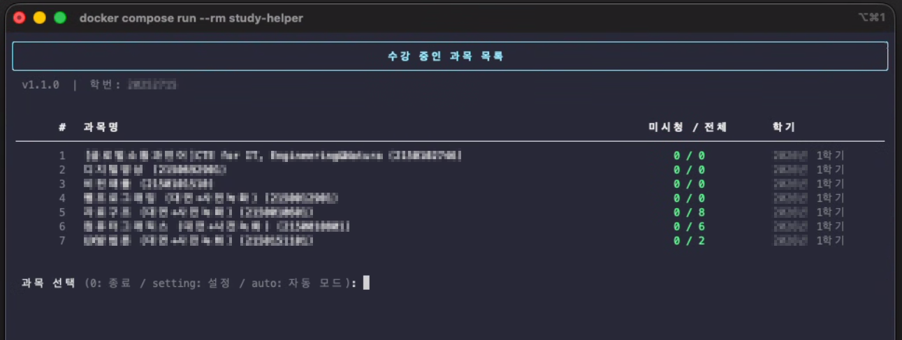
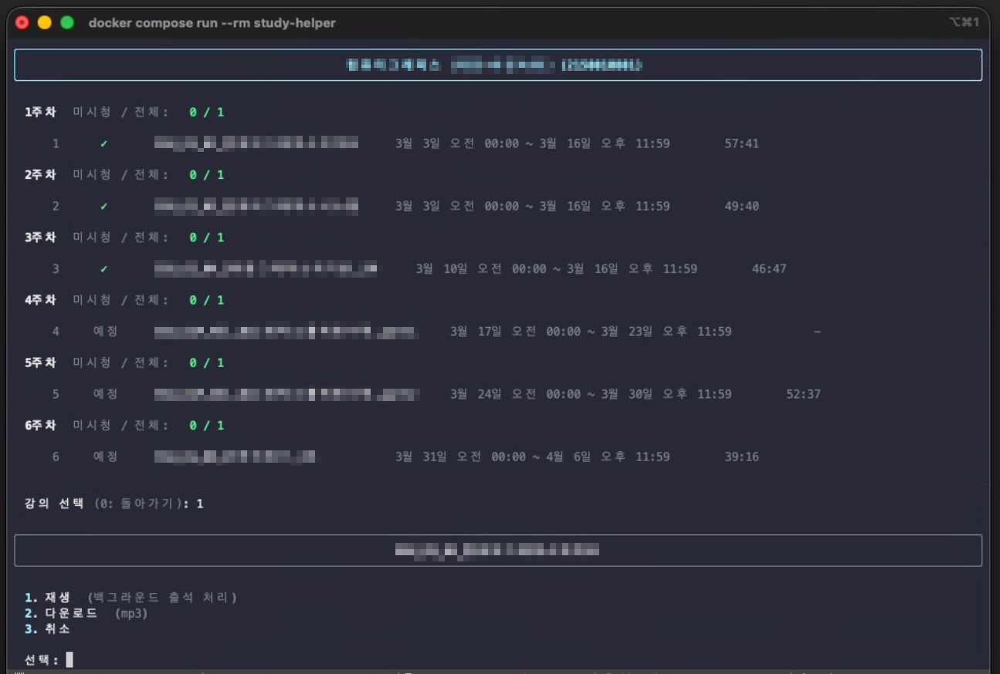
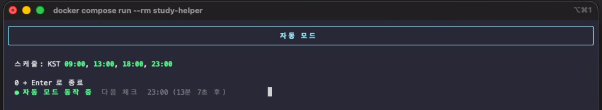

# study-helper

숭실대학교 LMS(canvas.ssu.ac.kr) 강의 영상을 Docker 컨테이너 환경에서 관리하는 CUI 도구입니다.

---

## 구동화면 샘플

**과목 목록**



**강의 목록**



---

## 기술 스택

    

    

---

## 주요 기능

- **백그라운드 재생** — 영상/소리 출력 없이 강의를 자동 재생
- **영상 다운로드** — 강의 영상을 mp4로 저장
- **음성 추출** — 강의 영상에서 음성을 mp3로 추출
- **Speech to Text** — faster-whisper를 이용한 로컬 음성 텍스트 변환
- **AI 요약** — 변환된 텍스트를 Gemini 또는 OpenAI API로 요약
- **텔레그램 알림** — 재생 완료, 다운로드 실패, AI 요약 완료 시 알림 전송
- **자동 모드** — 지정된 스케줄마다 미시청 강의를 자동으로 재생·다운로드·요약·알림 처리

---

## 시작 전 필요한 것

| 항목 | 설명 |
|------|------|
| 숭실대 LMS 계정 | 학번 + 비밀번호 |
| Docker | 컨테이너 실행 환경 |
| Gemini API 키 *(권장)* | AI 요약 사용 시 필요 — [발급 방법](docs/gemini-api-key.md) |
| 텔레그램 봇 *(권장)* | 알림 수신 시 필요 — [설정 방법](docs/telegram-setup.md) |

---

## 설치 및 실행

### 1. `docker-compose.yml` 다운로드

[최신 릴리즈](https://github.com/igor0670/study-helper/releases/latest)에서 `docker-compose.yml`을 다운로드하거나 아래 명령어로 받습니다.

```bash
curl -O https://raw.githubusercontent.com/igor0670/study-helper/main/docker-compose.yml
```

### 2. `.env` 파일 생성

`.env.example`을 다운로드 후 `.env`로 이름을 변경합니다.

```bash
curl -O https://raw.githubusercontent.com/igor0670/study-helper/main/.env.example
mv .env.example .env
```

### 3. 이미지 pull 및 실행

```bash
# Docker Hub에서 이미지 pull (최초 실행 시 자동으로 수행됨)
docker compose pull

# 실행
docker compose run --rm study-helper
```

> `docker compose up` 사용 금지 — 로그 멀티플렉싱으로 TUI가 깨집니다. `run --rm`만 사용하세요.

### 4. 초기 설정

최초 실행 시 자동으로 설정 화면이 표시됩니다. 학번/비밀번호를 입력하면 암호화되어 저장됩니다.

설정 이후에도 과목 목록 화면에서 `setting`을 입력하면 언제든지 설정을 변경할 수 있습니다.

---

## 사용 방법

실행하면 LMS에 자동 로그인 후 과목 목록이 표시됩니다.

```
  #    과목명                  미시청 / 전체    학기
 ─────────────────────────────────────────────────
  1    소프트웨어공학            3 / 12        2025-1
  2    데이터베이스              0 / 10        2025-1
  3    운영체제                  5 / 15        2025-1

  과목 선택 (0: 종료 / setting: 설정 / auto: 자동 모드):
```

과목 선택 후 주차별 강의 목록이 표시됩니다. 강의를 선택하면 다음 메뉴가 나타납니다:

```
  1. 재생
  2. 다운로드
  3. 취소
```

### 종료

| 방법 | 동작 |
|------|------|
| 과목 선택에서 `0` 입력 | 정상 종료 |
| `Ctrl + C` | 강제 종료 |

---

## 다운로드 경로

다운로드된 파일은 프로젝트 디렉토리의 `data/downloads/` 경로에 저장됩니다.

```
data/
└── downloads/
    ├── 과목명_강의명.mp4
    ├── 과목명_강의명.mp3
    ├── 과목명_강의명.txt
    └── 과목명_강의명_summarized.txt
```

---

## 설정 항목

과목 목록 화면에서 `setting` 입력으로 접근합니다.

| 항목 | 설명 |
|------|------|
| 다운로드 형식 | `video`(mp4) / `audio`(mp3) / `both`(mp4+mp3) |
| STT | Whisper 활성화 여부 및 모델 크기 |
| AI 요약 | Gemini 또는 OpenAI API 키 설정 |
| 텔레그램 알림 | 봇 토큰, Chat ID 설정 |

### Whisper 모델 크기

faster-whisper는 INT8 양자화를 적용하므로 openai-whisper 대비 모델 파일 크기가 약 절반입니다.

| 모델 | 크기 (INT8) | 정확도 |
|------|------------|--------|
| tiny | ~39MB | 낮음 |
| base | ~74MB | 보통 (기본값) |
| small | ~122MB | 좋음 |
| medium | ~385MB | 높음 |
| large | ~750MB | 최고 |

---

## 텔레그램 알림

재생 완료, 다운로드 실패, AI 요약 결과 등을 텔레그램으로 받을 수 있습니다.

설정 방법은 [텔레그램 설정 가이드](docs/telegram-setup.md)를 참고하세요.

---

## AI 요약

Gemini 또는 OpenAI API를 사용해 STT 결과를 자동 요약합니다.

Gemini API 키 발급 방법은 [Gemini API 키 발급 가이드](docs/gemini-api-key.md)를 참고하세요.

---

## 자동 모드



과목 목록 화면에서 `auto`를 입력하면 자동 모드로 진입합니다.

자동 모드는 지정된 스케줄(기본: KST 09:00 / 13:00 / 18:00 / 23:00)마다 미시청 강의를 자동으로 처리합니다.

```
재생(출석) → 다운로드 → STT 변환 → AI 요약 → 텔레그램 알림
```

대기 화면에서 `0` + `Enter`를 입력하면 자동 모드가 종료됩니다.

### 자동 모드 필수 조건

자동 모드를 사용하려면 아래 항목이 모두 설정되어 있어야 합니다. 미충족 시 설정 화면으로 안내됩니다.

| 항목 | 설정 위치 |
|------|-----------|
| STT 활성화 | 설정 → 텍스트 변환(STT) |
| AI 요약 활성화 + API 키 | 설정 → AI 요약 |
| 텔레그램 알림 활성화 + 봇 토큰/Chat ID | 설정 → 텔레그램 알림 |

### 주의사항

- **자동 모드 중에는 프로그램을 종료하지 마세요.** 재생 중 강제 종료 시 출석이 처리되지 않을 수 있습니다.
- 자동 모드는 `completion != completed` 상태인 모든 미시청 강의를 대상으로 합니다. 이미 수동으로 시청한 강의는 제외됩니다.
- 다운로드 형식은 설정의 `다운로드 규칙`을 따릅니다.
- 오류가 발생한 강의는 건너뛰고 텔레그램으로 오류 알림이 발송됩니다.

---

## 개발 참고

LMS 구조 분석, 재생/다운로드 구현 방식, 셀렉터 정의 등 기술 문서는 아래를 참고하세요.

- [LMS 구조 분석 정의서](docs/lms-analysis.md) — 인증, 과목/강의 스크래핑, 백그라운드 재생, 영상 다운로드 구현 분석

---

## 주의사항

- 본 도구는 개인 학습 목적으로만 사용하세요.
- LMS 서비스 약관을 준수하여 사용하시기 바랍니다.
- 학번, 비밀번호, API 키는 암호화되어 저장되며 `.env` 파일은 절대 외부에 공유하지 마세요.

### 면책 조항

본 프로젝트는 개인 학습 편의를 위해 제작된 비공식 도구입니다.

- 본 프로젝트의 사용으로 인해 발생하는 학사 불이익, 계정 제재, 데이터 손실 등 모든 결과에 대한 책임은 전적으로 사용자 본인에게 있습니다.
- 개발자는 어떠한 법적·도의적 책임도 지지 않습니다.
- 본 프로젝트는 [Claude AI](https://claude.ai)를 활용하여 개발되었습니다.
